# dockergcp 🐳👖⚓
dockergcp : Docker Container # Cloud Shell # Docker # Google Artifact Registry # Vulnerability

## Objective 
- Build, run, and debug Docker containers.
- Pull Docker images from Docker Hub and Google Artifact Registry.
- Push Docker images to Google Artifact Registry.
- Security: Container vulnerability scan report from Artifact Registry
    - CVE (Common Vulnerabilities and Exposures)
    - Package types scanned: Maven, Npm, OS, Rubygems, Rust, Nuget, Go, Composer, Python

## Docker Container & Google Artifact Registry

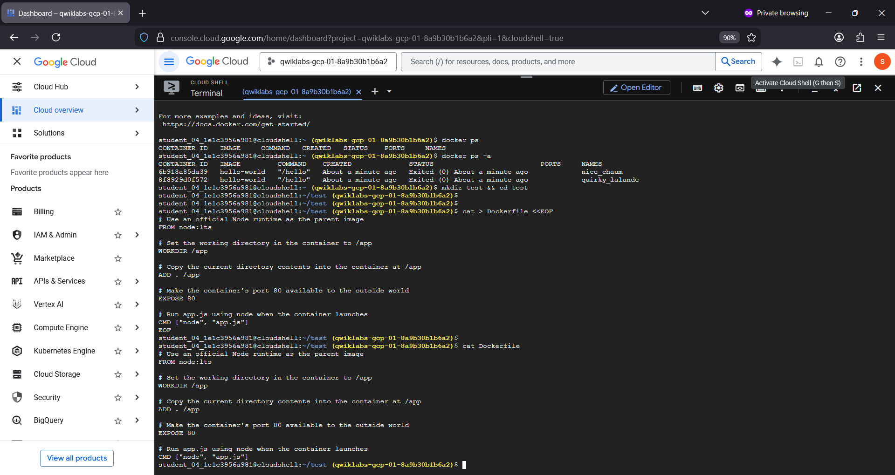

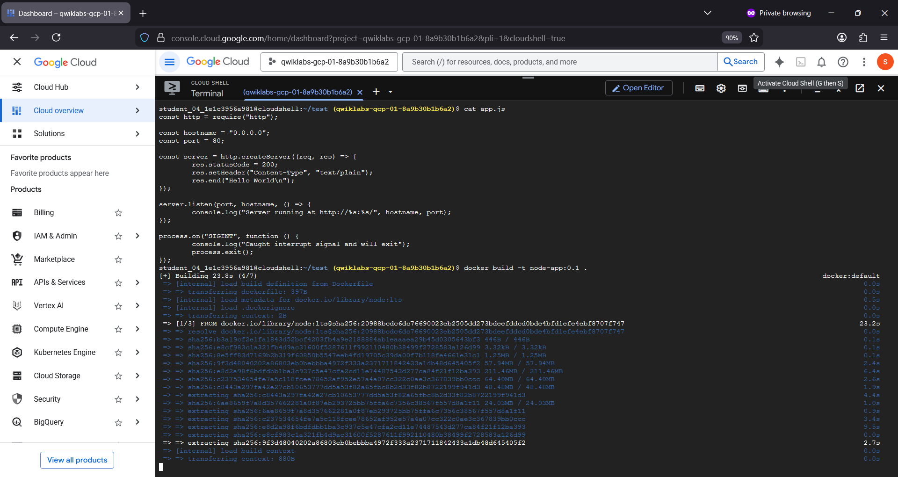

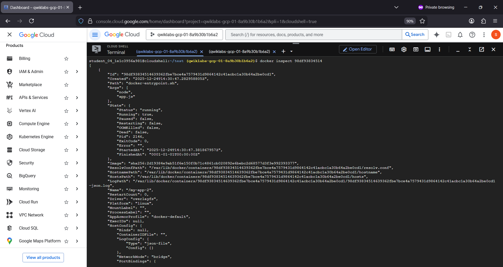

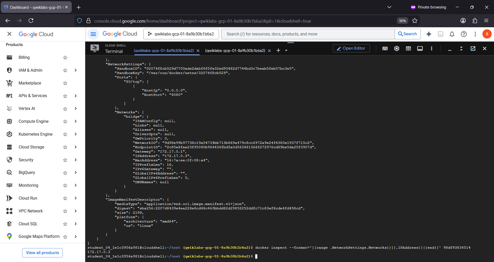

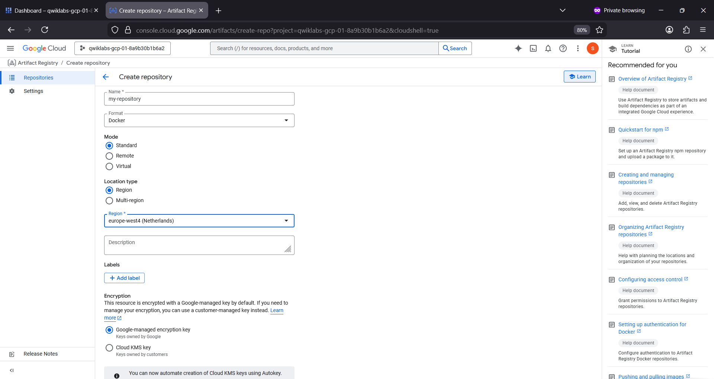

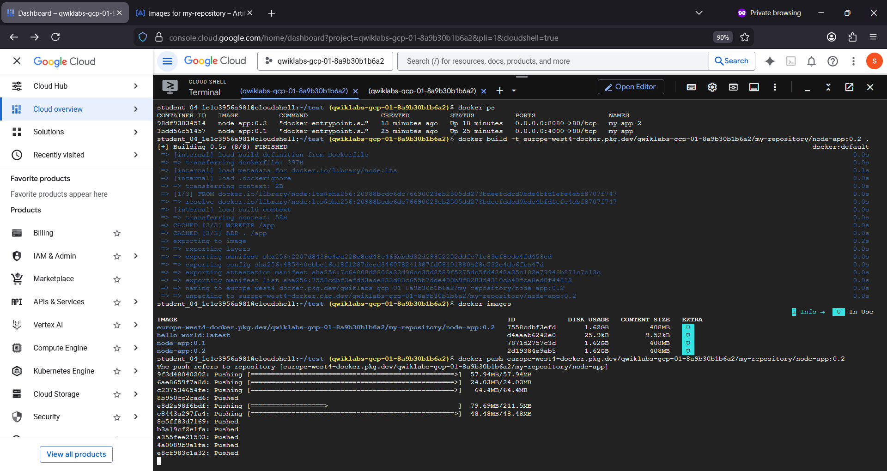

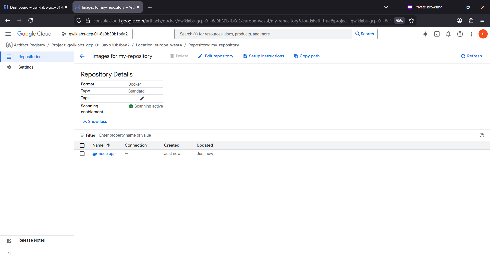

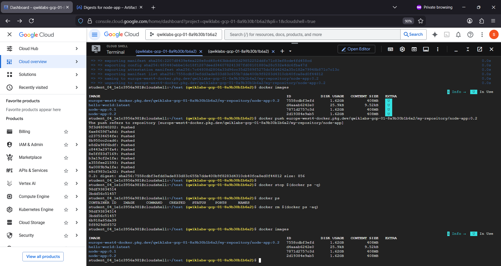

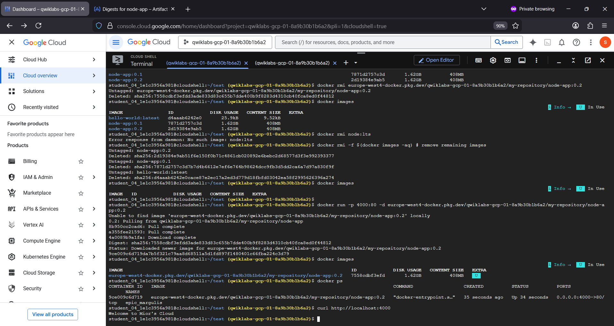

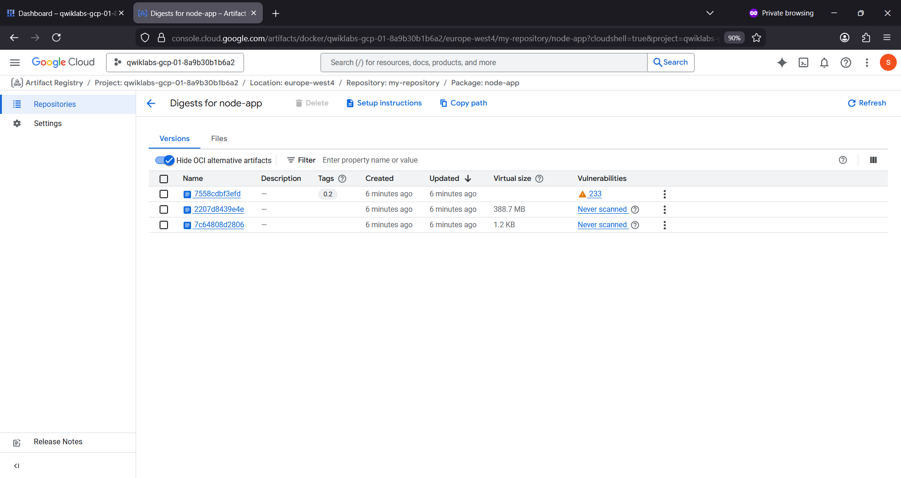

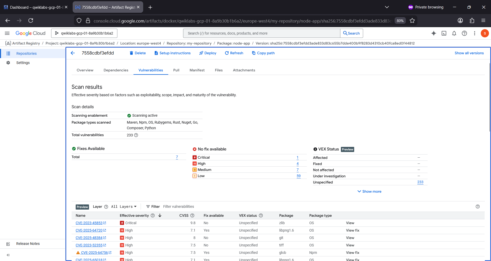

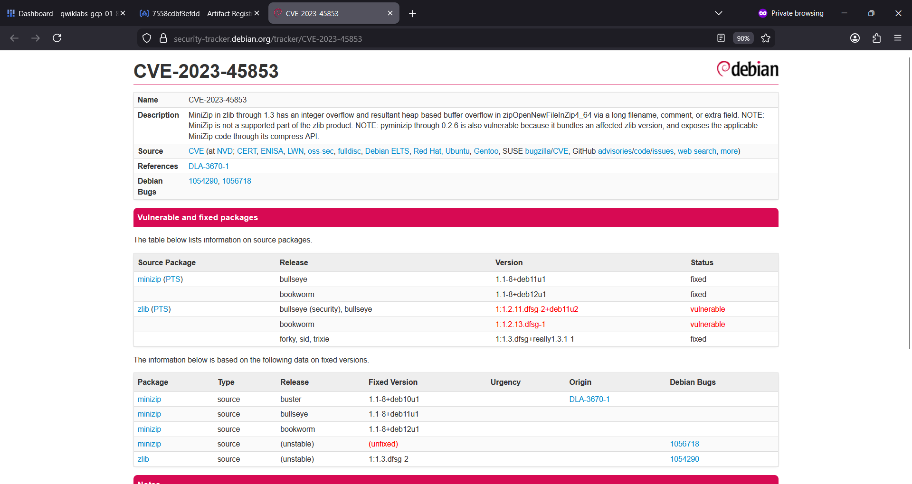

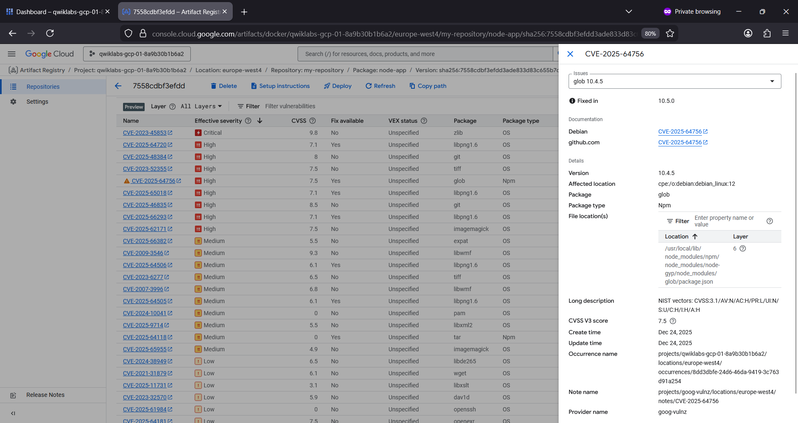

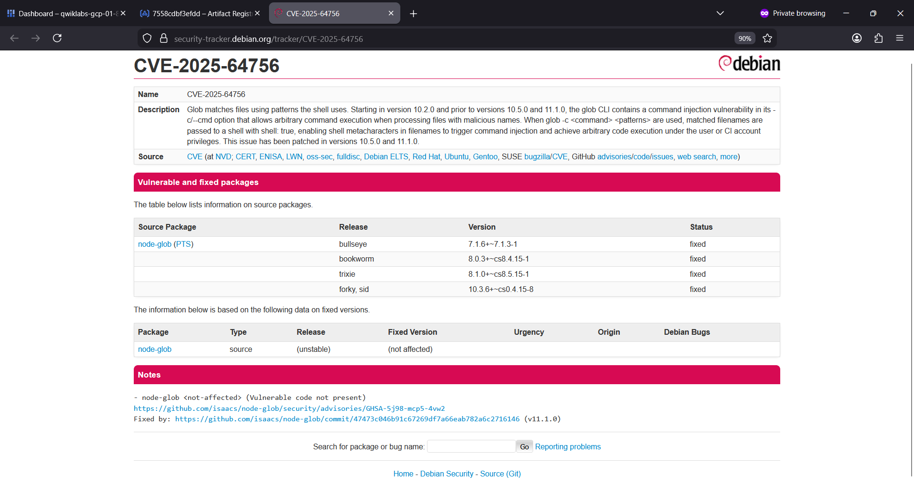

